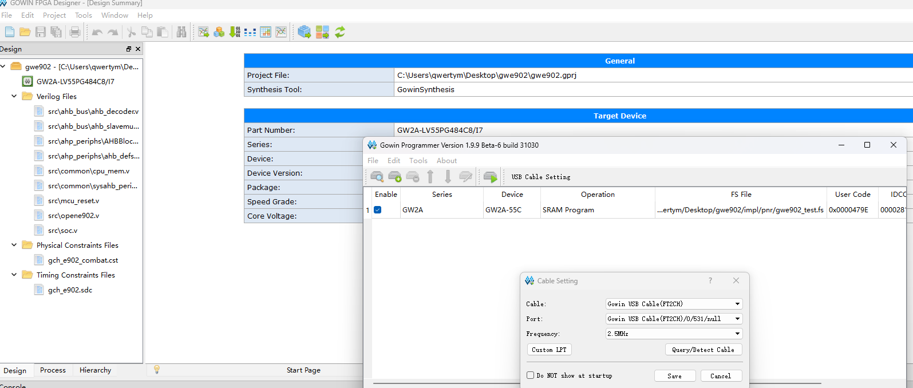
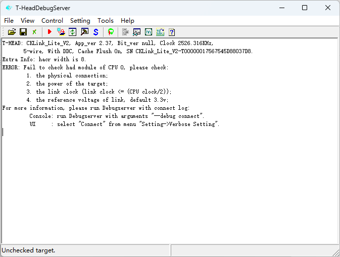

# 编译调试指南

## 高云IDE

### 启动

下载商业版高云ide，注意ide和programmer路径不能包含中文，linux下programmer需要超级用户权限。虚拟机改mac地址和添加虚拟网卡的知识自行搜索。

linux下可能会出现所有文字无法正常显示的问题，解决办法之一是删除lib文件夹下libfreetype文件，用系统的字体。其他不得而知。

### 从0开始的项目创建

原理上直接双击这个.pgrj就行了？没在其他地方测过。观察到高云IDE新建项目时本质只是创建文件夹和空的.gprj，打开项目后才会生成其他的文件。想改项目名的话应该打开项目前改文件夹名，或修改生成的project_process_config.json。

将src目录下所有文件添加到项目中即可。

### 综合、布线和烧写

如上手教程所示，均保持默认即可。

## T-Head DebugServer

一般来讲，只要是对的就不会错，有问题看那个报错信息也很难看出来什么

出现上图所示的情况还有有以下原因：

- fpga掉电后布线没了
- tck tms接错了
- 没用共地
- cpu_rst等复位信号生效中

### 调试器

貌似只用接 tck tms gnd 三条线，其他的线有什么用就不知道了

## Xuantie gcc 900 gnu toolchain

## VScode Cortex Debug

## crt0.s/linker.lcf

