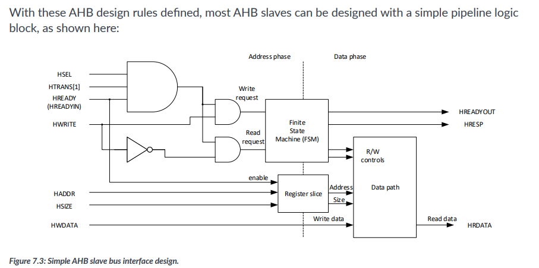
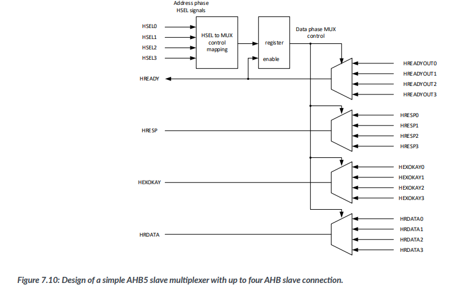

# soc设计

## 参考资料

1. [玄铁e092集成手册](https://github.com/T-head-Semi/opene902/blob/main/doc/%E7%8E%84%E9%93%81E902%E9%9B%86%E6%88%90%E6%89%8B%E5%86%8C.pdf)
2. [SoC Design with Arm Cortex-M Processor](https://www.arm.com/resources/ebook/system-on-chip-design)

## 综述

个人将soc设计想象成搭积木，也就是将各个组件拼接在一起。本质上来讲，就是把各种总线和设备和e902核连起来，类比一下就是装机给cpu配外设。最终的效果大概如下图所示：


## e902核


e902核提供的接口如上所示。部分比较简单的就在这个章节内介绍了：

### 时钟信号

顾名思义，系统时钟信号

关联：

- pad_had_jtg_tclk： jtag时钟频率必须小于 pll_core_cpuclk / 2
- 外部系统时钟（如ahb总线的）：与 pll_core_cpuclk 同频同相（也就是共用一个）

### dft系统集成

测试模式信号。一般来讲pad_yy_gate_clk_en_b=1'b1 pad_yy_test_mode=1'b0 即可

关联：

- pad_had_jtg_tclk： 测试模式下的系统时钟
- 低功耗模式：pad_yy_gate_clk_en_b 需设置为0

### 动态调频

见集成手册p17，调频操作为：置起dfs_req -> 等待dfs_ack置起 -> 调频 -> dfs_req置0 -> dfs_ack自动置0

### 调试信号

见集成手册p31。一般来讲只将外部调试请求pad_sysio_dbgrq_b置1即可。

关联：

- 低功耗模式：pad_sysio_dbgrq_b 唤醒，had_pad_jdb_pm 指示系统状态

### CPU运行观测信号

没研究过

## 总线系统综述

### 总线信号与设备



总线上的设备可以简化成这样。不需要从零开始设计而只是挂载现成的话，其实只要考虑输入信号和输出信号如何连在总线上即可。下面介绍一下各个信号的意义：

使能信号：

- hsel：通过 haddr 判断访问的是哪个设备，选中者 hsel 置 1
- htrans：传输类型，e902 只支持 00(idle), 10(nonseq)，也就是说实际只有高位是有意义的
- hready(hreadyin)：总线级别的“就绪”信号，本质上是所有设备的hready输出(hreadyout)与运算后的结果，代表总线是否被占用

如简图所示，ahb设备应当判断以上三个信号的值，当三者均为 1 时表示总线向该设备发出读/写请求，此时设备因将hready输出(hreadyout)置 0。若干时间后完成传输时，将hreadyout置 1。


传输类型信号：

- hwrite：读请求还是写请求
- hsize：传输宽度，按字节/2字节/字访问，00(byte), 01(half word), 10(word)，也就是说实际只有低两位有意义
- haddr：访问的地址

一般而言，haddr 需要转换成该设备中的实际地址（也就是简图中register slice部分的作用）。诸如 ram 等设备需要保证实际地址是有意义的，一个比较简单的做法就是只接有效部分的地址线

输出信号：

- hresp：传输应答，0(ok), 1(error)。default slave的hresp恒定为 1
- hready(hreadyout)：表示该设备是否占用总线，细节如前文所述

另外对于总线而言，还有用于标记当前总线状态的两个信号：

- hport：保护控制信号，指示当前总线周期进行的数据传输的特性，xxx0(取指)，xxx1(数据访问)等等，具体参见集成手册 p23
- hburst：突发传输指示信号，指示传输是一次突发传输的一部分。e902 只支持 000(single)，也就是说其实该信号没有用

### 地址空间


参照集成手册，cpu产生访问请求时，会由总线矩阵单元根据 haddr 抉择具体访问的是哪条总线。其中，指令和数据由pad_bmu_iahbl_mask区分，TCIP访问会在核内处理。一般而言，存指令挂在指令ahb上，数据的ram挂在系统ahb上，以实现取指和取数据可以同时执行。为了区分指令请求和数据请求（即总线矩阵判断对某个地址的请求是指令请求还是数据、走哪条总线），需要定义指令地址空间，地址范围内的请求都视为指令请求，走指令总线。

指令地址空间的大小并没有严格划分。比如我在指令总线挂一个512k的ram（IMEM_WIDTH=15，2^15=64kB），指令地址空间设置成512M也可以（e00h对应512M），意思是小于0x00200000地址的请求都会指向指令总线。需要注意的只有，指令地址空间的每一个地址都应该对应一个实际存在的地址，或者对应default slave产生错误。比如一个64k的rom只接低15位地址线，这样0x7000的访存就会被当成0x0的访存来响应。

### 挂载简单设备到总线

对于一个简单的设备，直接将其与总线相连即可。

``` verilog
ahb_slave x_ahb_slave0 (
    // 时钟
    .HCLK(sys_clk),
    .HRESETn(sys_resetn),
    // 输入
    .HSEL(hsel_s0),
    .HREADY(sysahb_hready),
    .HTRANS(sysahb_htrans),
    .HSIZE(sysahb_hsize),
    .HWRITE(sysahb_hwrite),
    .HADDR(sysahb_haddr),
    .HWDATA(sysahb_hwdata),
    // 输出
    .HREADYOUT(hready_s0),
    .HRESP(hresp_s0),
    .HRDATA(hrdata_s0)
);
```

需要额外处理的只有 hsel 和输出信号（hreadyout, hresp, hrdata）。

为了代码结构整齐，hsel 可以统一放在一个 ahb decoder 模块内处理（虽然也有小题大做之嫌），本质上就是根据 haddr 落在哪个区间决定 hsel 信号：

``` verilog
// ahb decoder sample

//addr range 1
`define S0_BASE_START 32'h20000000
`define S0_BASE_END   32'h207fffff
//addr range 2
`define S1_BASE_START 32'h40000000
`define S1_BASE_END   32'h407fffff
//addr range 3
`define S2_BASE_START 32'h60000000
`define S2_BASE_END   32'h607fffff

assign HSEL0 = (HADDR >= `S0_BASE_START) && (HADDR <= `S0_BASE_END);
assign HSEL1 = (HADDR >= `S1_BASE_START) && (HADDR <= `S1_BASE_END);
assign HSEL2 = (HADDR >= `S2_BASE_START) && (HADDR <= `S2_BASE_END);
// invalid addr, target to defalut slave to generate an error response
assign HSEL3 = !HSEL0 && !HSEL1 && !HSEL2; 
```

对于输出信号，应该统一连接到一个选择器，通过 hsel 信号来判断选择哪个设备的输出。大致如下：



## 指令总线

### 设置地址空间


如图，设置这两个值就行

### ram (iahb)

代码如下：

``` verilog
// cpu_mem.v

module cpu_mem (
    input wire sys_clk,
    input wire sys_resetn,
    input wire [31:0] haddr,
    input wire [2 :0] hburst,
    input wire [3 :0] hprot, 
    input wire [2:0] hsize,
    input wire [1:0] htrans,
    input wire [31:0] hwdata,
    input wire hwrite,
    output wire [31:0] hrdata,
    output wire hresp,
    output wire hready
);

wire hsel;
assign hsel = htrans[1]; // trans只有00/10两种取值

// IAHB Lite Memory, 64kB
AHBBlockRam x_iahb_bram (
    .HCLK(sys_clk),
    .HRESETn(sys_resetn),
    .HSEL(hsel),
    .HREADY(hready),
    .HTRANS(htrans),
    .HSIZE(hsize[1:0]),
    .HWRITE(hwrite),
    .HADDR(haddr[14:0]),
    .HWDATA(hwdata),
    .HREADYOUT(hready),
    .HRESP(hresp),
    .HRDATA(hrdata)
);
defparam x_iahb_bram.AWIDTH = 15; // 15位地址线

endmodule
```

由于该设计中，指令总线只有一个设备，故在hsel上偷懒了。一般来讲，如果要加上default slave以实现“haddr与ram内地址一一对应，访问超出ram地址区间的位置报错”的功能，应当根据haddr来判断是否使能hsel：

``` verilog
// simple haddr decoder

`define RAM_BASE_START 32'h000_00000
`define RAM_BASE_END   32'h000_07fff

assign HSEL_RAM = (HADDR >= `RAM_BASE_START) && (HADDR <= `RAM_BASE_END);
assign HSEL_ERRGEN = !HSEL0; 
```

ram 容量为 $2^{addr\_width}$ Byte，最大能有多大取决于fpga板子的硬件配置。在ram模块中，数据的存储可以看作4块 $8*2^{addr\_width-2}$ bit 的ram并排放在一起，总容量 $8*2^{addr\_width-2}*4$。为实现字、半字、字节的访问，取地址最后两位做片选信号，当hsize=00时选中片选信号对应的ram就行，半字则00对应1 2、10对应3 4选中，字访问则全部选中就行。

## 系统总线

``` verilog
module sysahb_periphs (
  input wire sys_clk,
  input wire sys_resetn,
  input wire [31:0] sysahb_haddr,
  input wire [31:0] sysahb_hwdata,
  input wire [2 :0] sysahb_hburst,
  input wire [2 :0] sysahb_hsize,
  input wire [1 :0] sysahb_htrans,
  input wire sysahb_hwrite,
  input wire [3 :0] sysahb_hprot,
  output wire sysahb_hready,
  output wire sysahb_hresp,
  output wire [31:0] sysahb_hrdata
);

wire hsel_s0;
wire hresp_s0;
wire hready_s0;
wire [31:0] hrdata_s0;

wire hsel_s1;
wire hresp_s1;
wire hready_s1;
wire [31:0] hrdata_s1;

··· ···

// sysahb slave1 bram 32kB
// Taken from page 28 of System-on-Chip Design with Arm Cortex-M processors
AHBBlockRam x_sysahb_bram (
    .HCLK(sys_clk),
    .HRESETn(sys_resetn),

    .HSEL(hsel_s0),
    .HREADY(sysahb_hready),
    .HTRANS(sysahb_htrans),
    .HSIZE(sysahb_hsize[1:0]),
    .HWRITE(sysahb_hwrite),
    .HADDR(sysahb_haddr[13:0]),
    .HWDATA(sysahb_hwdata),

    .HREADYOUT(hready_s0),
    .HRESP(hresp_s0),
    .HRDATA(hrdata_s0)
);
defparam x_sysahb_bram.AWIDTH = 14;

// sysahb slave2 default slave
// Taken from page 147 of System-on-Chip Design with Arm Cortex-M processors
ahb_defslave x_ahb_defslave(
    .HCLK(sys_clk), 
    .HRESETn(sys_resetn), 

    .HSEL(hsel_s1), 
    .HREADY(sysahb_hready),

    .HTRANS(sysahb_htrans), 
    .HREADYOUT(hready_s1), 
    .HRESP(hresp_s1) 
);

··· ···

ahb_decoder x_ahb_decoder(
    .HADDR ( sysahb_haddr ),
    .EN    ( 1'b1         ),
    .HSEL0 ( hsel_s0      ),
    .HSEL1 ( hsel_s1      )
    
    ··· ···
);

// ahb mux
// taken from system-on-chip-design-reference P150
ahb_slavemux x_ahb_slavemux(
    .HCLK       ( sys_clk       ),
    .HRESETn    ( sys_resetn    ),

    .HREADY     ( sysahb_hready ),
    .HSEL0      ( hsel_s0       ),
    .HREADYOUT0 ( hready_s0     ),
    .HRESP0     ( hresp_s0      ),
    .HRDATA0    ( hrdata_s0     ),
    .HSEL1      ( hsel_s1       ),
    .HREADYOUT1 ( hready_s1     ),
    .HRESP1     ( hresp_s1      ),
    .HRDATA1    ( hrdata_s1     ),
    .HSEL2      ( 1'b0          ), // 用不上的
    .HREADYOUT2 ( 1'b1          ),
    .HRESP2     ( 1'b0          ),
    .HRDATA2    ( 32'h0         ),
    
    ··· ···

    .HREADYOUT  ( sysahb_hready ),
    .HRESP      ( sysahb_hresp  ),
    .HRDATA     ( sysahb_hrdata )
);
endmodule
```

如前文所述，大致按这个感觉拼在一起就行

### ram (sysahb)

本质同[前文](#ram-iahb)

ram(iahb) 和 ram(sysahb) 的更多信息参考[另一篇教程](./build_debug_test.md#crt0slinkerlcf)

### default slave

从SoC Design with Arm Cortex-M Processor书里抄的，随便找一个就行，都是一样的

## apb总线

### 概述

大致和ahb相同，不过有几点设计规范：

``` verilog
module apb_subsystem (
    input  wire   [15:0]  HADDR, // 一般apb空间为0x40000000到0x4000ffff，共16位地址
);

// pclk=hclk/4，此时需要异步桥
wire PCLK;
CLKDIV clk_div2 (
  .HCLKIN(HCLK),
  .RESETN(HRESETn),
  .CALIB(1'b1),
  .CLKOUT(PCLK)
);
defparam clk_div2.DIV_MODE="4";
// 部分apb设备有PCLK和PCLKG两个时钟输入，在apb桥上有APBACTIVE信号用于指示将要访问apb设备
// PCLKG通过该信号生成，达到节能的目的；不过实际效果有限，不如直接PCLKG=PCLK
// wire PCLKG;
// wire APBACTIVE;
// assign PCLKG = APBACTIVE ? PCLK : 1'b0;

// 中断信号按需配置
wire [31:0]  apbsubsys_interrupt;
assign apb_interrupt[31:0] = {
    {20{1'b0}}, 
    gpioB_int[7:0],
    gpioA_int[7:0],
    gpioB_combint,
    gpioA_combint,
    uart0_txint,
    uart0_rxint
};

// async ahb to apb bridge
cmsdk_ahb_to_apb_async#(
    .ADDRWIDTH ( 16 ) // PADDR共16位
)u_cmsdk_ahb_to_apb_async(
);
// 根据PADDR[15:12]划分16个设备，设备地址依次为0x40000000，0x40001000...
// APB slave multiplexer
cmsdk_apb_slave_mux u_apb_slave_mux (
    // Inputs
    .DECODE4BIT        ( PADDR[15:12] ),
    .PSEL              ( PSEL         ),
    .PSEL0             ( uart0_psel    ),
    .PREADY0           ( uart0_pready  ),
    .PRDATA0           ( uart0_prdata  ),
    .PSLVERR0          ( uart0_pslverr ),
    // Output
    .PREADY            ( PREADY         ),
    .PRDATA            ( PRDATA         ),
    .PSLVERR           ( PSLVERR        )
);

// 操作外设本质是读写寄存器，一般apb寄存器均是4字节，故不接地址线低两位
// PADDR最高有几位根据设计变化，最大[11:2]
apb_gpio#(
    .PortWidth ( 8 )
) u_apb_gpioA(
    .PADDR   ( PADDR[7:2]    ), 
);

endmodule
```

### ahb_to_apb异步桥

这里选择直接拿cmsdk里面的cmsdk_ahb_to_apb_async用。其中还有一个cmsdk_ahb_to_apb的同步桥，该模块只支持pclk=hclk or hclk/2，这里为了通用性选了前者。


### gpio

gpio使用参考书里的代码。gpio需要将一对输入和输出绑成一个inout端口，需要用到叫三态门的东西。具体电路图和代码如下：


``` verilog

inout_gpio = out_en ? out : 1'bz; // 1'bz 高阻态
in = inout_gpio;

generate
     genvar j;
     for(j=0;j<8;j=j+1)
         begin: gpiob
             assign gpio_portA[j] = gpioA_outEn[j] ? gpioA_out[j] : 1'bz;
             assign gpioA_in[j] = gpio_portA[j];
         end
 endgenerate
```

串口中断分为单个端口的中断int[7:0]和整体的中断combint，按照需要设置就行。

### uart

uart使用参考书里的代码。对于uart中bauddiv寄存器的值，需要根据pclk和目标波特率进行配置，bouddiv=plck/boud，差1差2不影响。例如实例中pclk=1.6875mHz，波特率9600时bauddiv=1.6875m/9600=176，实际上在±5范围内都是可以的。

## 复位控制

总体设计参考下面这张图，不过改了不少。官方案例里的相关代码散落在各个不相关文件的各处角落，比较难找。下图中两个d触发器的作用是实现异步复位同步释放，使得复位信号的上升沿和时钟信号上升沿同步。代码样例见mcu_reset.v的注释。


除了还有另一种设计方式，主要参考了soc design p27，主要是想要满足“发出的系统复位请求至少保持两个周期”的目的，大概设计如下所示。


``` verilog
// ensure external power-on-reset is synchronized to HCLK,
// Taken from page 28 of System-on-Chip Design with Arm Cortex-M processors
reg [1:0] mcu_rst_reg;
always @(posedge sys_clk or negedge mcu_rst_signal)
begin
 if (mcu_rst_signal == 1'b0) begin
    mcu_rst_reg <= 2'b0; //异步复位
 end    
 else begin
    mcu_rst_reg[0] <= 1'b1;
    mcu_rst_reg[1] <= mcu_rst_reg[0]; // 两个时钟周期后释放
 end    
end
assign mcu_rstn = mcu_rst_reg[1]; // 使上电复位上升沿与clk同步

// cpu_pad_soft_rst[0]发出内核复位请求，等待2周期执行
reg [1:0] cpu_rst_reg;
always @(posedge sys_clk or negedge mcu_rstn) begin
  if (~mcu_rstn) begin
    cpu_rst_reg <= 2'b00;
  end 
  else begin
    cpu_rst_reg[0] <= cpu_pad_soft_rst[0];
    cpu_rst_reg[1] <= cpu_rst_reg[0] & cpu_pad_soft_rst[0];
  end
end
assign cpu_rst = ~cpu_rst_reg[1]; // 即cpu_pad_soft_rst[0]=1两周期后，或上电复位信号mcu_rstn=0时处理器复位

// cpu_pad_soft_rst[1]发出系统复位请求，等待2周期执行
reg [1:0] sys_rst_reg;
always @(posedge sys_clk or negedge mcu_rstn) begin
  if (~mcu_rstn) begin
    sys_rst_reg <= 2'b00;
  end 
  else begin
    sys_rst_reg[0] <= cpu_pad_soft_rst[1];
    sys_rst_reg[1] <= sys_rst_reg[0] & cpu_pad_soft_rst[1];
  end
end
assign sys_rst = ~sys_rst_reg[1]; // 即cpu_pad_soft_rst[1]=1两周期后，或上电复位信号mcu_rstn=0时系统复位

// 见集成手册p19
assign pad_cpu_rst_b = cpu_rst & sys_rst;
assign pad_had_rst_b = sys_rst;
assign pad_had_jtg_trst_b = mcu_rstn;

assign sys_resetn = sys_rst;
```

## JTAG支持

e902采用自制的两线协议，具体可以参考[https://gitee.com/cdkmodules/T-HeadDebugServer](https://gitee.com/cdkmodules/T-HeadDebugServer)。平时只需要接tclk、tms两线并且共地，设计可参考集成手册 p32，大致如下：

``` verilog
input jtag_tclk,
inout jtag_tms
....
assign i_pad_jtg_tms = had_pad_jtg_tms_oe ? had_pad_jtg_tms_o : 1'bz; // CPU 外部应利用jtg_tms_oe将jtg_tms_i和jtg_tms_o信号合为一个双向端口信号。
assign pad_had_jtg_tms_i = i_pad_jtg_tms; // jtg_tms_i在空闲时必须保持为高电平，同时空闲时时钟信号需要停止翻转
....
assign pad_had_jtg_trst_b = mcu_rstn; // 系统复位/上电复位
....
openE902 x_e902 (
  .pad_sysio_dbgrq_b    (1'b1), // 可用于使 CPU 进入调试模式或使 CPU 从仅关闭时钟的低功耗状态唤醒，不需要则置1
  // .had_pad_jdb_pm       (had_pad_jdb_pm), 处理器工作模式指示信号，用不上注释掉就行
);
```

实物层面的可以参考[另一篇教程](./build_debug_test.md#t-head-debugserver)

## 中断系统 

待研究

## 低功耗

待研究
