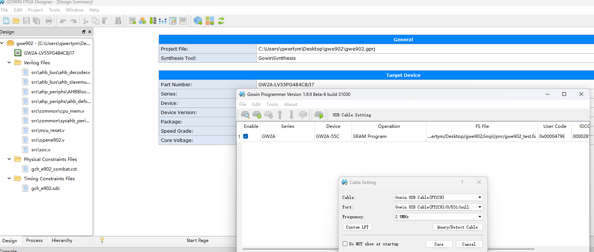

# e902 getting start guide

## 准备

1. e902 rtl sorce code [https://github.com/T-head-Semi/opene902](https://github.com/T-head-Semi/opene902) (no need to build)
2. xuantie 900 gnu toolchain [Xuantie-900-gcc-elf-newlib-mingw-V2.8.0](https://www.xrvm.cn/community/download?id=4237187318466809856) (choose elf, mingw for win, x86_64 for linux)
3. gowin ide and programmer [http://www.gowinsemi.com.cn/faq.aspx](http://www.gowinsemi.com.cn/faq.aspx)
4. T-Head DebugServer [https://www.xrvm.cn/community/download?id=4238019891233361920](https://www.xrvm.cn/community/download?id=4238019891233361920)

注：平头哥玄铁资源下载的网站想找个东西挺难的，而且可能以后这个链接就失效了。gnu toolchain大致在开发-编译工具-TAC里面找，T-Head DebugServer在调试工具里面找就行。gnu toolchain也可以换成其他地方的，比如[随便哪家](https://www.nucleisys.com/index.php)。

运行gen_e902将rtl目录里所有代码放在一个文件里：

``` ps1
#!/ps1
# gen_e902.ps1 {path to E902_RTL_FACTORY} {E902_asic_rtl.fl}

param (
    $CODE_BASE_PATH,
    $FL_NAME = "E902_asic_rtl.fl"
)
$OUT_NAME = "opene902.v"
Remove-Item $OUT_NAME

$files = (Get-Content $CODE_BASE_PATH/gen_rtl/filelists/$FL_NAME) -match '\.[vh]$' -replace "\$\{CODE_BASE_PATH\}", ${CODE_BASE_PATH} 
foreach ($file in $files) {
    Write-Host "Appending $file to $OUT_NAME..."
    Get-Content $file | Add-Content $OUT_NAME
}
```

记住gnu toolchain的地址，届时需要用这套工具链编译/调试。

## fpga编程

在高云ide里新建工程，加入刚刚重新生成的opene902.v，然后正常写verilog代码、cst引脚设置、sdc时钟约束等。最后综合、布线通过后烧写rtl代码。



记得sram模式下掉电就得重新烧一次。

## 代码编译

makefile、linker.lcf、crt0.s都是从官方smart_run目录下翻出来的，其中前两个需要自己修改。

makefile中设置TOOL_EXTENSION为之前下载的gnu toolchain路径
 
``` makefile
TOOL_EXTENSION := C:/Users/qwertym/Desktop/fpga/Xuantie-900-gcc-elf-newlib-mingw-V2.8.0/bin

CC      = ${TOOL_EXTENSION}/riscv64-unknown-elf-gcc.exe
AS      = ${TOOL_EXTENSION}/riscv64-unknown-elf-as.exe
LINK    = ${TOOL_EXTENSION}/riscv64-unknown-elf-ld.exe
OBJDUMP = ${TOOL_EXTENSION}/riscv64-unknown-elf-objdump.exe
OBJCOPY = ${TOOL_EXTENSION}/riscv64-unknown-elf-objcopy.exe
```

linker.lcf的分区需要按照自己的fpga设计来修改

## T-Head DebugServer 与 VSCode Cortex Debug

运行T-HeadDebugServer，成功的结果如下所示。此时就可以用gdb调试了。

不过注意，这里要用的gdb得是gnu toolchain里的那个。


也可以选择 vscode cortex debug 来更加优雅地调试。下载 cortex debug 插件后啥都不用配，新建 launch.json ，修改内容如下：

``` json
{
    "version": "0.2.0",
    "configurations": [
        {
            "name": "Cortex Debug",
            "cwd": "${workspaceFolder}",
            "executable": "./sw/fill_array/fill_array.elf", // elf/bin文件
            "request": "launch", // launch/attach
            "type": "cortex-debug",
            "runToEntryPoint": "main",
            "servertype": "external", // *
            "gdbTarget": "localhost:1025", // t-head debugserver上显示的ip和端口
            "gdbPath": "C:/Program/fpga/Xuantie-900-gcc-elf-newlib-mingw-V2.8.0/bin/riscv64-unknown-elf-gdb.exe", // gnu toolchain的路径
            "showDevDebugOutput": "raw" // 可选，Cortex Debug的详细输出
        }
    ]
}

```

## 测试

目录内各个文件已经编译完毕，将gwe902_test.fs烧写到fpga后，开启t-head debugserver，f5运行即可。测试效果为可正常将fill_array.elf传到e902中并运行，可正常断点调试。

# Q&A
