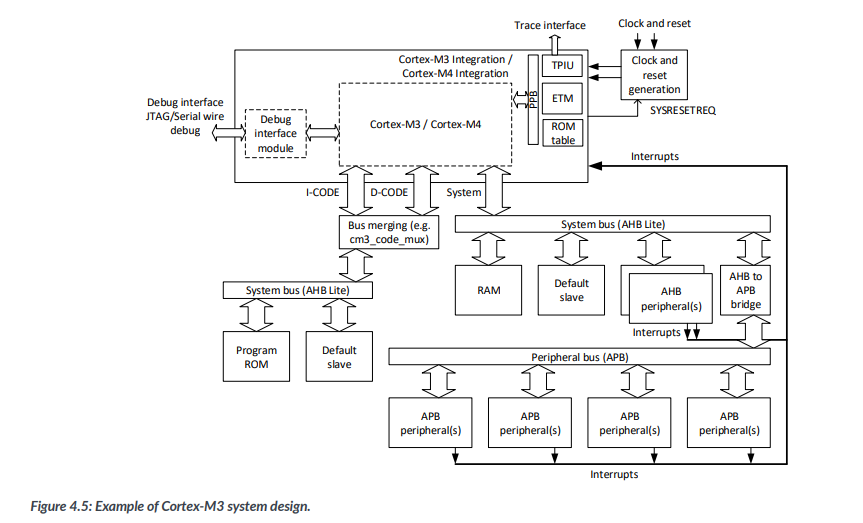
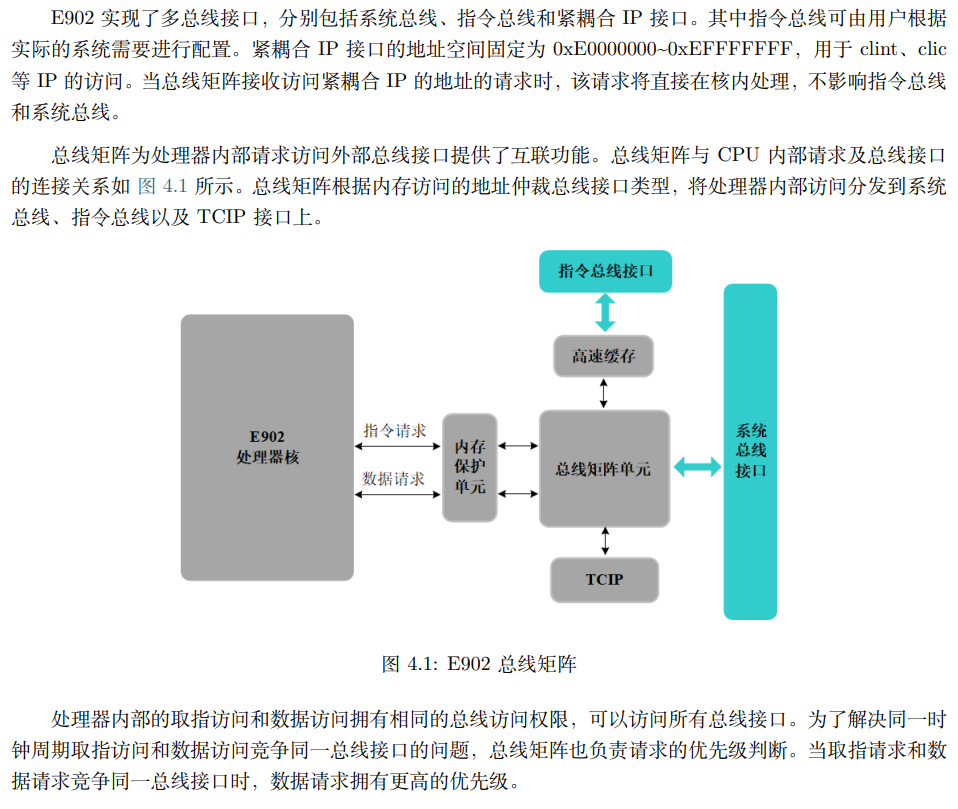
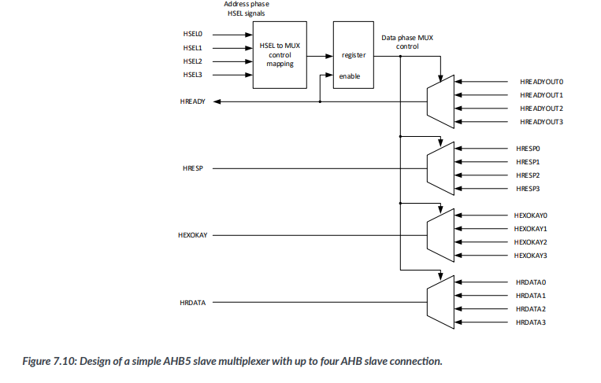
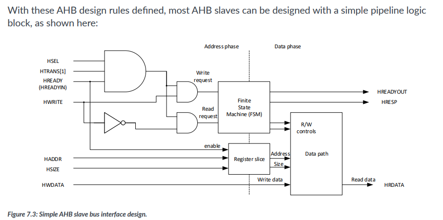
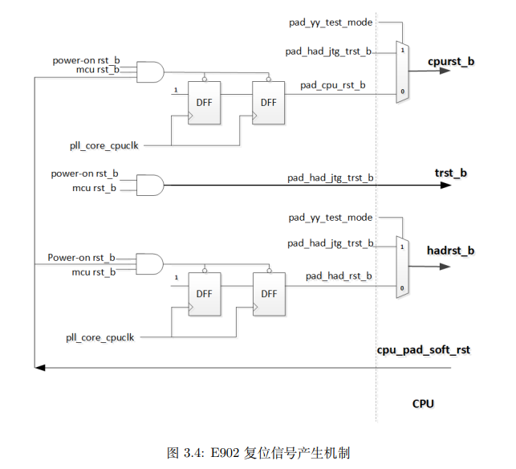
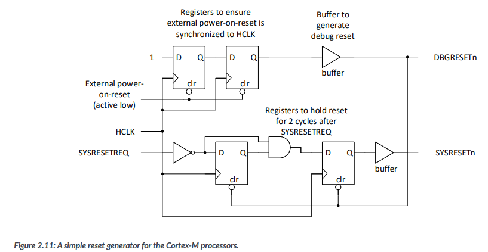

# 记录

随笔而已，大量过时信息和碎碎念，有意义的之后会整理在其他文档里的

# 总线结构

个人对此的理解主要参照了这张图，大概最终做出来类似的东西吧。




# 指令ahb总线

这部分主要参考官方样例里的cpu_sub_system_ahb.v，没啥要改的，增加了部分注释，删去了些多余代码。~~不过目前还是不太了解细节上的许多东西，比如说为什么这条ahb不需要挂default slave等。~~


## 取指、取数据原理



e902核共有指令总线、系统总线、TCIP三条总线，当cpu产生访问请求时，会由总线矩阵单元抉择具体访问的是哪条总线。其中，指令和数据由pad_bmu_iahbl_mask区分，TCIP访问会在核内处理。

学了很久才明白不该纠结于教材上各种死板的定义，非得划分个“冯诺依曼结构”和“哈佛结构”根本没意义，或者说“在宏观上是冯诺依曼结构微观上是哈佛结构”云云。每个地址都既可以存指令也可以存数据，取指、取数据也可以同时进行（例如cortex-m3中imem dmem bus mutiplexer的设计）。

## 指令地址空间

参考https://xuantie.t-head.cn/document?temp=yg02bn&slug=xuantie-cpu-userguide

下载程序时，大概通过linker script确定程序和数据分别加载到哪个地址区间。一般而言，存指令挂在指令ahb上，数据的ram挂在系统ahb上，以实现取指和取数据可以同时执行。为了区分指令请求和数据请求（即总线矩阵判断对某个地址的请求是指令请求还是数据、走哪条总线），需要定义指令地址空间，地址范围内的请求都视为指令请求，走指令总线。

指令地址空间的大小并没有严格划分，大于等于实际容量就行。如smart_run中指令总线挂一个512M的ram（IMEM_WIDTH=19，2^19=512MB），然后将指令地址空间设置成512M也行（e00h对应512M），可以省去default slave。需要注意的只有，指令地址空间的每一个地址都应该对应一个实际存在的地址，或者对应default slave产生错误。比如一个256B的内存只接低八位地址线，这样0x100的访存就会被当成0x00的访存来响应，实际上也可以，总之非常宽松就是了。

# 系统ahb总线

主要参考了官方样例程序中的 ahb.v 文件。代码比较清晰，大概能看懂起到了什么作用就行。
``` verilog
// ahb decoder
assign    hsel_s1 = (biu_pad_htrans[1]==1'b1) && (biu_pad_haddr >= `S1_BASE_START) && (biu_pad_haddr <= `S1_BASE_END) 
                  && !arb_block && !smpu_deny;
assign    hsel_s2 = (biu_pad_htrans[1]==1'b1) && (biu_pad_haddr >= `S2_BASE_START) && (biu_pad_haddr <= `S2_BASE_END) 
                  && !arb_block && !smpu_deny;
assign    hsel_s3 = (biu_pad_htrans[1]==1'b1) && (biu_pad_haddr >= `S5_BASE_START) && (biu_pad_haddr <= `S5_BASE_END) 
                  && !arb_block && !smpu_deny;

assign    hsel_s4 = (biu_pad_htrans[1]==1'b1) && (!hsel_s1 && !hsel_s2 && !hsel_s3 || smpu_deny) && !arb_block; // addr not match
```

这段主要是根据输入的haddr信号选择对应地址的ahb设备、产生对应的hsel选择信号。在这里，s4是default slave，即地址非法时的默认设备。default slave的设计参考err_gen.v文件，其余可参考soc design p146

``` verilog
case({busy_s1,busy_s2,busy_s3,busy_s4})
    4'b1000:
    begin
      pad_biu_hrdata[31:0] = hrdata_s1[31:0];
      pad_biu_hready       = hready_s1;
      pad_biu_hresp[1:0]   = hresp_s1[1:0];
    end
    4'b0100:
    begin
      pad_biu_hrdata[31:0] = hrdata_s2[31:0];
      pad_biu_hready       = hready_s2;
      pad_biu_hresp[1:0]   = hresp_s2[1:0];
    end
    4'b0010:
    begin 
      pad_biu_hrdata[31:0] = hrdata_s3[31:0];
      pad_biu_hready       = hready_s3;
      pad_biu_hresp[1:0]   = hresp_s3[1:0];
    end
    4'b0001:
    begin 
      pad_biu_hrdata[31:0] = hrdata_s4[31:0];
      pad_biu_hready       = hready_s4;
      pad_biu_hresp[1:0]   = hresp_s4[1:0];
    end
    default:
    begin
      pad_biu_hrdata[31:0] = 32'b0;
      pad_biu_hready       = 1'b1;
      pad_biu_hresp[1:0]   = 2'b0;
    end
  endcase
```

这段代码大致就是下图的结构。busy变量产生自hsel/hready信号，除此之外的细节还不怎么理解，应该是选中后或传输结束时延缓一个周期？



hready信号可以这么来理解：所有设备的hready输出(hreadyout)进行与操作，就是总线上的hready信号，每个设备再读这个信号是否为1(此时也可称hreadyin)来判断总线是否空闲。



# ahb设备

## ram

ram的设计主要参照mem_ctrl.v/iahb_mem.ctrl.v，其中两个本质上没有区别，后者写得更好些。soc_fpga_ram实现了ram的存储功能，而iahbl_mem_ctrl主要是控制ram的读取方式。

数据的存储可以看作4块 8\*2^(addr_width-2) bit 的ram并排放在一起，总容量 8\*2^(addr_width-2)\*4。为实现字、半字、字节的访问，取地址最后两位做片选信号，当hsize=00时选中片选信号对应的ram就行，半字则00对应1 2、10对应3 4选中，字访问则全部选中就行。

简化版本的设计可以参考AHBBlockRam.v，简单省心实用。

目前还不太理解官方样例里面的两个文件为什么要这么设计，大概是从asic那里抄来的代码？目前看得出来的是，两个实现的内容本质上是相同的，或者是前者是后者的劣质模仿。在mem_ctrl.v中，除了上述基本操作外，额外实现了“如果读的是上一次写（还未写入）的地方，则直接返回写的内容”的功能，iahbl_mem_ctrl额外实现了“读相同地方返回相同值”、“写相同地方只写一次”。虽然看着挺好，但说实话目前还想不出有啥用。不过既然已经写好了，大概当成黑箱来用应该也不会有太大问题吧。

# 复位控制信号

总体设计参考下面这张图，不过改了不少。官方案例里的相关代码散落在各个不相关文件的各处角落，比较难找。下图中两个d触发器的作用是实现异步复位同步释放，使得复位信号的上升沿和时钟信号上升沿同步。代码样例见mcu_reset.v的注释。



除了还有另一种设计方式，主要参考了soc design p27，主要是想要满足“发出的系统复位请求至少保持两个周期”的目的，大概设计如下所示。



``` verilog
// ensure external power-on-reset is synchronized to HCLK,
// Taken from page 28 of System-on-Chip Design with Arm Cortex-M processors
reg [1:0] mcu_rst_reg;
always @(posedge sys_clk or negedge mcu_rst_signal)
begin
 if (mcu_rst_signal == 1'b0) begin
    mcu_rst_reg <= 2'b0; //异步复位
 end    
 else begin
    mcu_rst_reg[0] <= 1'b1;
    mcu_rst_reg[1] <= mcu_rst_reg[0]; // 两个时钟周期后释放
 end    
end
assign mcu_rstn = mcu_rst_reg[1]; // 使上电复位上升沿与clk同步

// cpu_pad_soft_rst[0]发出内核复位请求，等待2周期执行
reg [1:0] cpu_rst_reg;
always @(posedge sys_clk or negedge mcu_rstn) begin
  if (~mcu_rstn) begin
    cpu_rst_reg <= 2'b00;
  end 
  else begin
    cpu_rst_reg[0] <= cpu_pad_soft_rst[0];
    cpu_rst_reg[1] <= cpu_rst_reg[0] & cpu_pad_soft_rst[0];
  end
end
assign cpu_rst = ~cpu_rst_reg[1]; // 即cpu_pad_soft_rst[0]=1两周期后，或上电复位信号mcu_rstn=0时处理器复位

// cpu_pad_soft_rst[1]发出系统复位请求，等待2周期执行
reg [1:0] sys_rst_reg;
always @(posedge sys_clk or negedge mcu_rstn) begin
  if (~mcu_rstn) begin
    sys_rst_reg <= 2'b00;
  end 
  else begin
    sys_rst_reg[0] <= cpu_pad_soft_rst[1];
    sys_rst_reg[1] <= sys_rst_reg[0] & cpu_pad_soft_rst[1];
  end
end
assign sys_rst = ~sys_rst_reg[1]; // 即cpu_pad_soft_rst[1]=1两周期后，或上电复位信号mcu_rstn=0时系统复位

// 见集成手册p19
assign pad_cpu_rst_b = cpu_rst & sys_rst;
assign pad_had_rst_b = sys_rst;
assign pad_had_jtg_trst_b = mcu_rstn;

assign sys_resetn = sys_rst;
```

# jtag调试接口

e902采用自制的两线协议，具体可以参考[https://gitee.com/cdkmodules/T-HeadDebugServer](https://gitee.com/cdkmodules/T-HeadDebugServer)。平时只需要接tclk、tms两线并且共地，设计可参考集成手册 p32，大致如下：

``` verilog
input jtag_tclk,
inout jtag_tms
....
assign i_pad_jtg_tms = had_pad_jtg_tms_oe ? had_pad_jtg_tms_o : 1'bz; // CPU 外部应利用jtg_tms_oe将jtg_tms_i和jtg_tms_o信号合为一个双向端口信号。
assign pad_had_jtg_tms_i = i_pad_jtg_tms; // jtg_tms_i在空闲时必须保持为高电平，同时空闲时时钟信号需要停止翻转
....
assign pad_had_jtg_trst_b = mcu_rstn; // 系统复位/上电复位
....
openE902 x_e902 (
  .pad_sysio_dbgrq_b    (1'b1), // 可用于使 CPU 进入调试模式或使 CPU 从仅关闭时钟的低功耗状态唤醒，不需要则置1
  .had_pad_jdb_pm       (had_pad_jdb_pm),// 处理器工作模式指示信号，用不上就空着吧
);
```

注意，如果布线时选择的是sram program，烧完别掉电就行。之后使用gdb进行连接，具体怎么操作还待研究。

# 中断

看不懂为啥这样就行了

``` verilog
assign pad_clic_int_vld[ 31 : 0] = pad_vic_int_vld[ 31 : 0];
assign pad_clic_int_vld[64 - 1 : 32] = 'h0;
assign pad_cpu_ext_int_b  =1'b1;
```
